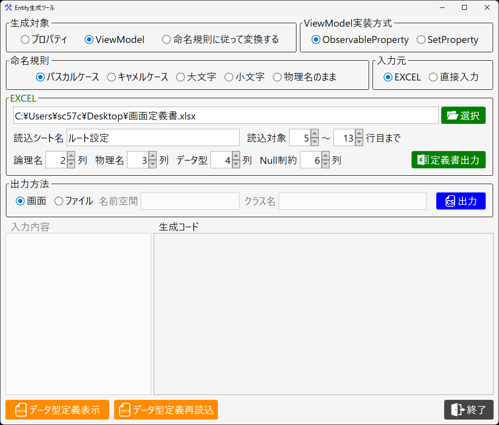

# EntityGenerator

C# エンティティクラスおよび ViewModel のプロパティコードを自動生成する WPF ツールです。

## なぜ作ったか

O/R マッパーは、データベースからエンティティクラスを自動生成するところまでは面倒を見てくれます。しかし実際の開発では、そのエンティティをそのまま画面や外部連携に使うことは少なく、用途ごとに微妙に異なる DTO・Model・ViewModel を何度も手作業で書き起こすことになりがちです。フィールド構成はほとんど同じなのに、Nullable の扱いや命名規則、MVVM の ObservableProperty 化など、層ごとに「形」が違うだけで、結局同じ作業の繰り返しになります。

EntityGenerator は、この「似ているのに毎回手で書き直す」反復作業を、テーブル定義書（Excel）や直接入力したカラム名から 1 クリックで済ませるためのツールです。

また、手作業での書き写しは、命名規則の変換ミスや大文字・小文字の付け忘れ、タイプミスといった揺らぎを必ず生みます。EntityGenerator はプログラムによる機械的な変換で名称を生成するため、定義書の記述さえ正しければ、命名の揺らぎやスペルミスが混入する余地がありません。速度だけでなく、この正確性も本ツールの狙いの一つです。

テーブル定義書（Excel）または直接入力したカラム名をもとに、スネークケースからパスカル・キャメルケース等への変換を行い、C# のプロパティコードを生成します。



---

## 機能

- **入力元の選択**：Excel（テーブル定義書）または直接入力に対応
- **生成対象の選択**：プロパティ / ViewModel / 命名規則変換のみ
- **命名規則の選択**：パスカルケース / キャメルケース / 大文字 / 小文字 / 物理名のまま
- **出力方法の選択**：画面出力 / ファイル出力（.cs ファイル）
- **データ型定義のカスタマイズ**：JSON ファイルで定義書のデータ型と C# データ型のマッピングを自由に編集可能
- **設定の自動保存 / 復元**：前回の設定値を次回起動時に復元

---

## 動作環境

- Windows 10 以降

---

## 使い方

### Excelから生成する場合

1. 入力元で「EXCEL」を選択
2. Excel ファイルを選択
3. 読み込むシート名・行範囲・各列番号を設定
4. 生成対象・命名規則・出力方法を選択
5. 「出力」ボタンをクリック

### 直接入力から生成する場合

1. 入力元で「直接入力」を選択
2. 入力欄にカラム名を1行1項目で入力（スネークケース）
3. 生成対象・命名規則を選択
4. 「出力」ボタンをクリック

---

## データ型定義のカスタマイズ

初回起動時に以下のパスへデフォルトのデータ型定義ファイルが自動生成されます。
```
%APPDATA%\EntityGenerator\DataTypes.json
```

このファイルを編集することで、定義書上のデータ型と C# のデータ型のマッピングをカスタマイズできます。

```json
[
    { "DefDataType": "文字列", "CsDataType": "string" },
    { "DefDataType": "整数", "CsDataType": "int" },
    { "DefDataType": "日付時刻", "CsDataType": "DateTime" }
]
```

編集後は「データ型定義再読込」ボタンで反映できます。

---

## 拡張について

EXCEL 読み込み・命名規則変換・コード生成は、それぞれ独立した処理として実装されています。コード生成部分（プロパティ / ViewModel の出力ロジック）を差し替えれば、Java の Bean クラスなど、他言語の同種のボイラープレートコード生成にも応用できる構造になっています。

---

## このツールについて

製品として配布することを想定したものではなく、社内での業務改善用に「困ったらソースを直接書き換えて使う」ことを前提にしたツールです。そのため、ログ出力の仕組みは設けておらず、エラーハンドリングも最小限にとどめています。エラーを握りつぶしている箇所は、設定ファイルの読み込み失敗時など、代替手段がなく握りつぶす以外に取りようがない箇所に限っています。動作に違和感があれば、遠慮なくソースをデバッグ実行して確認・修正してください。

---

## 使用ライブラリ

- [CommunityToolkit.Mvvm](https://github.com/CommunityToolkit/dotnet) - MVVM 実装
- [ClosedXML](https://github.com/ClosedXML/ClosedXML) - Excel 読み込み

---

## ライセンス

MIT License